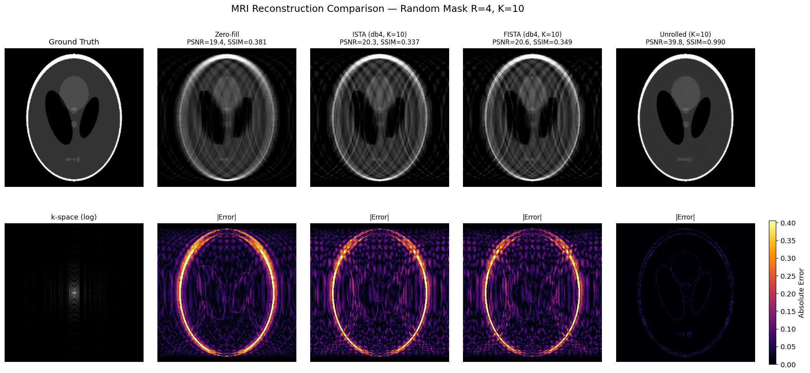

# Physics-Guided MRI Reconstruction

From zero-filled baselines to learned unrolled networks — a complete, research-quality implementation of compressed sensing and physics-guided deep learning for MRI reconstruction.

<p align="center">
  
</p>

## What This Project Does

MRI scanners acquire data in the spatial-frequency domain (k-space). Undersampling k-space speeds up scans but introduces aliasing artifacts. This project implements and compares four reconstruction approaches, each building on the last:

| Method | Approach | PSNR (R=4) | Key Idea |
|--------|----------|------------|----------|
| **Zero-fill** | Adjoint (F^H M y) | ~19 dB | Baseline — just inverse FFT the acquired data |
| **ISTA** | Proximal gradient descent | ~20 dB | Wavelet sparsity prior, O(1/k) convergence |
| **FISTA** | Accelerated proximal gradient | ~21 dB | Nesterov momentum, O(1/k²) convergence |
| **Unrolled ISTA** | Physics-guided learned network | ~35+ dB | Learned CNN proximal operators, end-to-end trained |

The unrolled network keeps the physics (data-consistency via the MRI forward model) while learning the regularization (CNN replaces wavelets), achieving substantially better reconstruction quality.

## Project Structure

```
mri-reconstruction-unrolled
├── notebooks/
│   ├── 01_kspace_basics.ipynb      # k-space fundamentals, masks, zero-fill
│   ├── 02_ista_recon.ipynb         # Wavelet-regularized ISTA & FISTA
│   ├── 03_unrolled_recon.ipynb     # Unrolled ISTA with learned CNN proximal ops
│   ├── 04_analysis.ipynb           # Monte Carlo eval, noise robustness, ablations
├── src/                        # Reusable research library
│   ├── masks.py                # Cartesian undersampling masks
│   ├── fft_ops.py              # MRI forward model (NumPy + PyTorch)
│   ├── metrics.py              # PSNR, SSIM, NMSE
│   ├── wavelets.py             # Wavelet transforms (PyWavelets + PyTorch Haar)
│   ├── ista.py                 # ISTA/FISTA solvers with tuning utilities
│   ├── unrolled.py             # Unrolled ISTA architecture
│   ├── train.py                # Training loop, dataset, CLI entry point
│   ├── eval.py                 # Evaluation pipelines (Monte Carlo, noise, sweeps)
│   └── viz.py                  # Figure generation
├── figures/                    # Generated figures
└── requirements.txt
```

## Key Technical Details

**Forward model.** The MRI acquisition is modeled as `y = M · F · x` where F is the orthonormal 2D DFT (`norm="ortho"`) and M is a binary Cartesian undersampling mask. Using orthonormal FFT keeps operator norms at 1, which simplifies step-size analysis.

**Mask convention.** All masks live in the unshifted FFT domain where DC is at index 0. The fully-sampled center band wraps around index 0 (columns `{0,...,c-1} ∪ {N-c,...,N-1}`), preserving low-frequency content that carries bulk image contrast.

**Classical reconstruction.** ISTA and FISTA solve `min_x (1/2)||Ax - y||² + λ||Ψx||₁` where Ψ is a db4 wavelet transform (level 4). Step size τ < 0.5 guarantees convergence since L = 2||A||² = 2 for binary masks with orthonormal FFT.

**Unrolled network.** Each of K=10 layers performs a data-consistency gradient step with a learned step size η_k, followed by a residual CNN proximal operator. The step sizes are parameterized as exp(log_η_k) to stay positive. Per-layer (not shared) proximal blocks give each iteration its own learned regularizer.

**Fair baselines.** Classical methods use db4 wavelets (level 4) with grid-searched (step, λ) — not weak Haar wavelets. All methods are compared at the same iteration/layer count K on identical test masks.

## Notebooks

**NB1 — k-Space Basics.** Builds intuition for k-space, undersampling, and the zero-filled reconstruction baseline. Demonstrates the importance of the fully-sampled center band.

**NB2 — Compressed Sensing.** Implements ISTA and FISTA with wavelet soft-thresholding. Includes convergence plots (PSNR and SSIM), hyperparameter sweeps across acceleration factors, and a comparison of Cartesian vs random masks.

**NB3 — Unrolled Reconstruction.** Trains the physics-guided unrolled ISTA network. Compares against tuned classical baselines with publication-quality figures. Includes quality-vs-K analysis and learned step-size visualization.

**NB4 — Analysis & Ablations.** Research-grade experimental methodology: Monte Carlo evaluation over 20 random masks per condition (with error bars), noise robustness study (SNR 10–60 dB), empirical convergence rate verification (O(1/k) vs O(1/k²) on log-log plots), ROI zoom-ins, PSF visualization, shared vs per-layer proximal operator ablation, and acceleration factor sweeps.

## Quick Start

```bash
# Install dependencies
pip install -r requirements.txt

# Run the notebooks in order (1 → 2 → 3 → 4)
jupyter notebook

# Or train from the command line
python -m src.train --epochs 20 --K 10 --channels 16 --checkpoint-dir checkpoints/
```

Using the library directly:

```python
import numpy as np
from skimage.data import shepp_logan_phantom
from skimage.transform import resize
from src import masks, fft_ops, ista, metrics

image = resize(shepp_logan_phantom(), (256, 256)).astype(np.float32)
mask = masks.random_cartesian_mask(256, accel=4, rng=np.random.default_rng(42))
y = fft_ops.forward_np(image, mask)

x_recon, history = ista.fista(y, mask, truth=image, verbose=True)
print(metrics.compute_all_np(x_recon, image))
```

## Requirements

Python 3.9+, PyTorch, NumPy, PyWavelets, scikit-image, matplotlib. See `requirements.txt` for pinned versions.

## Acknowledgments

This project implements ideas from foundational work in compressed sensing MRI (Lustig et al., 2007), proximal optimization (Beck & Teboulle, 2009), and algorithm unrolling for inverse problems (Monga et al., 2021).
